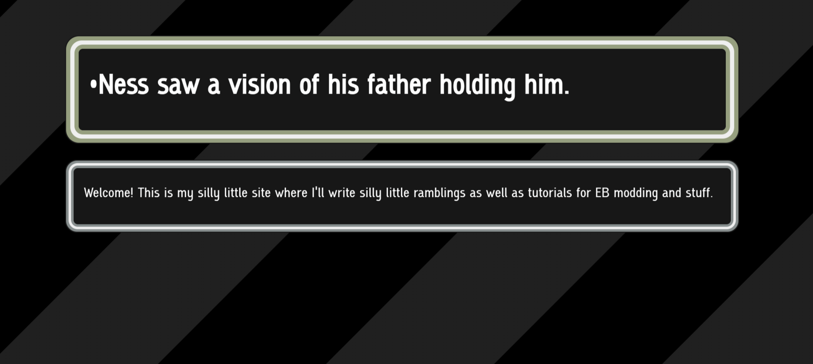

I just finished migrating this website to use the [Astro](https://astro.build/) framework, at the recommendation of [a friend](https://axoga.to/).
I have dabbled a little with web frameworks before, but I never liked any of them. They always seemed to impose weird rules and required you to learn
a lot of systems of their own through (often) poor documentation. So, I checked out Astro cautiously, but I ended up really loving it.

## Maintaining the site up til now

*The oldest snapshot of the site on archive.org*

This site started out on Neocities and was just me writing a few HTML files by hand. I think this is a perfectly fine way to run a site if it's just
a little personal page, and I also encourage anyone who has a carrd or strawpage or whatever to give it a go. It's 100% yours and it's free!

In my case, I had a very clear idea of what I wanted my site to look like. Title at the top, nav on the left, content on the right. This shape persists
across basically all of my pages, and it means that my pages had a LOT of boilerplate, especially as the navpane grew in size. All up, there was 84 lines
of boilerplate that formed the foundation of my pages, and it meant that if I ever wanted to make any fundamental changes, it'd be a huge task.
So I just never did.

Eventually I put together a Python script to keep the navpane up-to-date, and when I added the blog I used [Eleventy](https://www.11ty.dev/) for the blog
section, but that was as far as I went with using tools to keep things in sync.

## Migrating

It took me a little while to get to grips with Astro. The tutorial didn't really help me have that moment where it all clicks and you get how you're meant
to do things. I ended up starting from the almost-empty minimal template so I knew the bare minimum needed to get going.

Immediately what struck me is how much Astro *doesn't* force you to play by its rules. Even though it's designed in such a way that it encourages you to use
its own features, it won't reject regular HTML, global stylesheets, not using a page template ... etc. This made the migration very approachable!
I could copy over big chunks of my site over unchanged and then slowly convert everything to use components, embedded scripts and styles, and so on, bit by bit,
all while the dev server could be running without the site refusing to compile or looking half-baked.

That's the big thing that made me like Astro over other ones I've used in the past. So, even if your site is smaller than mine
and you just have a handful of common elements, you can bring things over and use as many or as few Astro features as much or as little as you'd like.

I also found the blog a lot easier to set up this time around! It took me a minute to wrap my head around the "collections" system, 
which is just kinda an afterthought in the main tutorial, but the blog backend is far simpler than it was with Eleventy.

> By the way! Because the site is hosted on GitHub Pages for the time being, it's actually [open-source](https://github.com/Supremekirb/supremekirb.github.io).
If you're interested in using Astro, you can see how I've set things up.

## The future of the site

This site has been slowly building up over for about a year and a half and I won't be stopping that any time soon. It's something that is intensely *mine*; 
I've improved it, polished it, and added new things over and over (there's probably a good metaphor for this).
Just recently, I added an [online ROM patcher](/games/patcher) so you can get my ROM hacks without having to download and apply the patches yourself. 
I'll continue to add more tools to the tools section, and when I get the gamedev bug again I'll try to get some things that can be played online too.
And I want to write more for the blog!

If you run a little personal site of your own, I hope this post motivates you to keep adding onto it. And if it's starting to get hard to manage,
definitely check out Astro.